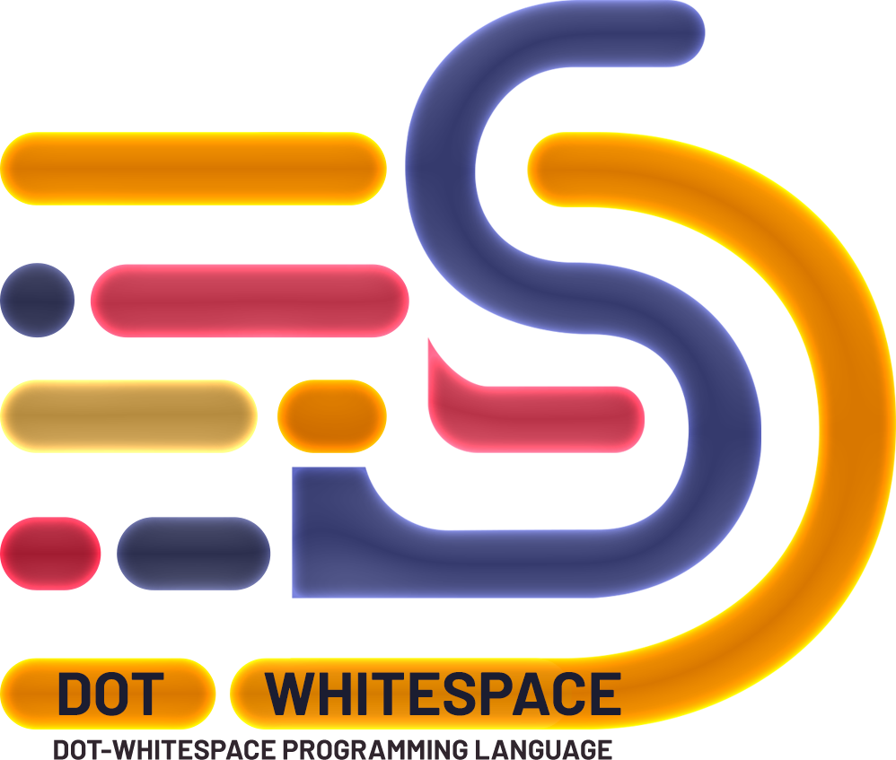

# Dot-Whitespace Interpreter

## DotWhitespace Programming Language

DotWhitespace is an esoteric programming language created by Max Base. It was released on July 17, 2020. Its name refers to the characters of white space and dots. Unlike most programming languages, which ignore most white space characters or give less meaning. Only distances, tabs, dots and lines are meaningful.



(The image will change as soon as new proprietary images are ready)

### Hello, World in `.Whitespace`

`$ python DotWhitespace.py examples/hello-world.ds`

```
.. .        .     .            .            .               ..                       .               .                  .            .    .
```

Output: `hello world`

### Sample Program

```
. . .  .   .	. .  .   .
. . .  .   .		. .  .   .
. . .  .   .	  .   .    . .
.. 	. .  .   .
.. . .  .   .
..   . .
..   . . .	   . .
..   . . 	   . 
```

It is actually equivalent to:

```
.S.S.SS.SSS.T.S.SS.SSS.     ; DEFINE abc ('STR', 'abc')
.S.S.SS.SSS.TT.S.SS.SSS.    ; DEFINE abc ('VAR', 'abc')
.S.S.SS.SSS.TSS.SSS.SSSS.S. ; DEFINE abc ('NUM', 1230)
..ST.S.SS.SSS.              ; PRINT ('VAR', 'abc')
..S.S.SS.SSS.               ; PRINT ('STR', 'abc')
..SSS.S.                    ; PRINT ('NUM', 10)
..SSS.S.S.TSSS.S.           ; PRINT ('NUM', 120) 
..SSS.S.STSSS.S             ; PRINT ('NUM', 120)
```

Output:

```
1230
abc
10
120
120
```

## Whitespace

This language was inspired by [Whitespace](https://en.wikipedia.org/wiki/Whitespace_(programming_language)).

However DotWhitespace is not a whitespace interpreter, and the grammar is different in many ways.

It also has dots, For example:

## DotWhitespace Commands

There are only three types of commands in this language.

`S` means whitespace character.

- Print to console (String or Number directly or from a variable)
```
..S
```

- Read input from console (not yet developed); __I need help from others.__
```
...S
```

- Variable definition
```
.S
```

### Operators

`T` means tab character. (`\t`)

| Syntax  | Operator |
| ------- | -------- |
|   T     | +        |
| TT      |  -       |
| TTT     | *        |
| TTTT    | /        |
| TTTTT   | ^        |
| TTTTTT  |  %       |

Note: There are no parentheses, So the priority of the operators will not support all mathematics expression.

### Debug

You can pass `-debug` argument, then you will see debug information in **stout**.

e.g: `$ python DotWhitespace.py examples/hello-world.ds -debug`
or `$ python DotWhitespace.py -debug examples/hello-world.ds`

Output:

```
('PRINT', ('STR', 'hello world'))
hello world
```

### Examples

- Input: `. . .  .   .\t. .  .   .\n`

DEFINE abcd ('STR', 'abcd')

- Input: `. . .  .   .\t\t. .  .   .\n`

DEFINE abcd ('VAR', 'abcd')

- Input: `. . .  .   .\t  .   .    . .\n`

DEFINE abcd ('NUM', 1230)

- Input: `.. \t. .  .   .\n`

PRINT ('VAR', 'abcd')

- Input: `.. . .  .   .\n`

PRINT ('STR', 'abcd')

- Input: `..   . .\n`

PRINT ('NUM', 10)

- Input: `..   . . .\t   . .\n`

PRINT ('NUM', 120)

- Input: `..   . . \t   . \n`

PRINT ('NUM', 120)

### Characters supported as string:

`(space)abcdefghijklmnopqrstuvwxyzABCDEFGHIJKLMNOPQRSTUVWXYZ0123456789!@#$%^&*()_-=+?<>[]{}`

Note: You will not be able to print any characters other than the above.

### TODO

- Implement **float number**.
- Display Tree of program.
- Implement Read Input. (`input()` in python or `scanf()` in c)

### ChangeLog

- [x] 2020-07-23: Get filename from argument and reads from file.
- [x] 2020-07-23: Adding `whitespace` (\s) as supported character. (e.g: we want to display `Hello World`, Not `HelloWorld`)

### Similar Projects

- https://github.com/BaseMax/MiniCalculatorInterpreter
- https://github.com/BaseMax/CFG2CNF


### Acknowledgments

The grammar idea for this language was first taken from Whitespace, but these have nothing to do with each other and are different in many ways.

Thanks to Prof. Jeremy Douglass for mentions this to me. [#1](https://github.com/BaseMax/DotWhitespace/issues/1)

---------

# Max Base

My nickname is Max, Programming language developer, Full-stack programmer. I love computer scientists, researchers, and compilers. ([Max Base](https://maxbase.org/))

## Asrez Team

A team includes some programmer, developer, designer, researcher(s) especially Max Base.

[Asrez Team](https://www.asrez.com/)

